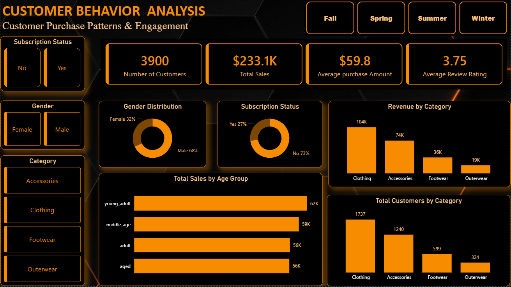

# Customer Shopping Behavior Analysis

## Overview

This project focuses on analyzing customer shopping behavior to uncover valuable business insights. The workflow includes data loading, exploratory data analysis (EDA), data cleaning, SQL-based business analysis, interactive dashboard development in Power BI, report generation, and presentation creation.

The objective is to understand customer purchasing patterns, product performance, subscription behavior, and revenue trends to support data-driven decision-making.

---

## Dataset

The dataset contains customer shopping transactions with information related to:

* Customer demographics
* Product categories
* Purchase amounts
* Subscription status
* Review ratings
* Discounts and promotions
* Shipping preferences
* Purchase history

### Dataset Summary

* Rows: 3,900
* Columns: 18
* Data Source: Customer Shopping Behavior Dataset

---

## Tools & Technologies

### Programming & Analysis

* Python
* Pandas
* NumPy

### Database

* MySQL / SQL Server

### Visualization

* Power BI

### Documentation & Presentation

* Microsoft Excel
* Gamma
* PDF Reports

---

## Project Workflow

### 1. Data Loading

* Imported the dataset into Python using Pandas.
* Inspected data structure and data types.

### 2. Exploratory Data Analysis (EDA)

* Generated summary statistics.
* Analyzed distributions and patterns.
* Identified missing values and inconsistencies.
* Explored customer demographics and purchasing behavior.

### 3. Data Cleaning

* Handled missing values.
* Standardized column names.
* Removed redundant fields.
* Created additional features such as age groups.
* Validated data quality and consistency.

### 4. SQL Analysis

The cleaned dataset was loaded into MySQL for business analysis.

Key business questions answered:

* Revenue by Gender
* High-Spending Discount Users
* Top Rated Products
* Shipping Type Comparison
* Subscribers vs Non-Subscribers
* Discount-Dependent Products
* Customer Segmentation
* Top Products by Category
* Repeat Buyer Analysis
* Revenue by Age Group

### 5. Power BI Dashboard

An interactive dashboard was developed to visualize key business metrics.

Dashboard Features:

* KPI Cards
* Interactive Slicers
* Revenue Analysis
* Customer Segmentation
* Category Performance
* Subscription Analysis
* Demographic Insights

### 6. Reporting & Presentation

* Created a detailed project report summarizing findings.
* Designed a professional presentation using Gamma.
* Presented business recommendations based on analysis results.

---

## Dashboard Preview




---

## Key Insights

* Identified high-performing product categories.
* Analyzed customer spending behavior.
* Evaluated the impact of subscriptions on revenue.
* Segmented customers based on purchasing history.
* Discovered opportunities for targeted marketing campaigns.

---

## Business Recommendations

* Strengthen customer loyalty programs.
* Promote subscription-based benefits.
* Optimize discount strategies.
* Focus marketing efforts on high-value customer segments.
* Prioritize top-performing products and categories.

---

## Project Structure

```text
Customer-Shopping-Behavior-Analysis/
│
├── data/
├── notebooks/
├── sql/
├── powerbi/
├── reports/
├── presentation/
├── screenshots/
└── README.md
```

---

## How to Run

1. Clone the repository

```bash
git clone https://github.com/your-username/Customer-Shopping-Behavior-Analysis.git
```

2. Install required Python libraries

```bash
pip install pandas numpy matplotlib seaborn
```

3. Run the Jupyter Notebook

```bash
jupyter notebook
```

4. Execute SQL queries in MySQL/SQL Server.

5. Open the Power BI dashboard (.pbix file) to explore insights interactively.

---

## Author

**Abinash R**

Aspiring Data Analyst | Python | SQL | Power BI | Excel


